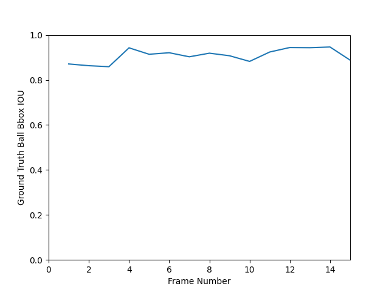
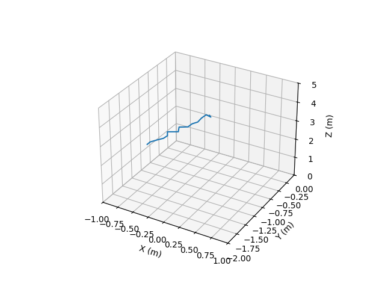
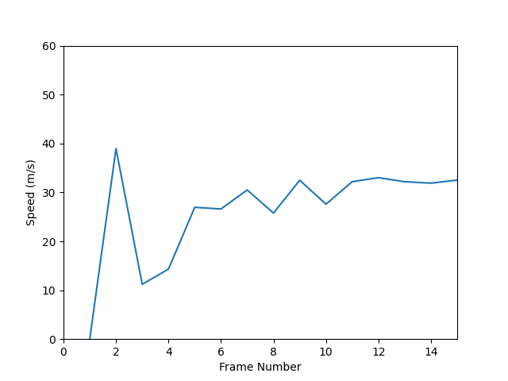

# Rapsodo Task

## Description
The goal of this task is to estimate the speed vector of a ball when a baseball player hits it. There are 15 images available for analysis.

## Installation
To install the required dependencies, run the following command:

`
pip3 install -r requirements.txt
`

## File Structure
**images** folder contains the input images.

**gt_masks** folder contains images that are masked target ball

**outputs** folder contains program outputs

**outputs/metadata** folder contains raw program outputs

**output/predictions** folder contains images that predicted target ball with bounding box

**output/plots** folder contains plotted graphs from raw program outputs.

## Running
The program has two main subprograms.

### Main
It simply executes Runner with specified configuration file and feeds output file to Plotter.

`
python3 main.py configuration.yaml
`

### Runner
It executes the logic behind estimating speed vectors.

`
python3 runner.py configuration.yaml
`

### Plotter
It plots the output of the Runner.

`
python3 plotter.py outputs/metadata/output.csv
`

## Problem

### Setup

1. There are 15 images captured with 240FPS.
2. Pixel size of the camera is 0.0048mm.
3. Width of the camera is 1024px.
4. Height of the camera is 1280px.
5. Focal length of the camera is 8mm.
6. Radius of the ball is 0.0373m.
7. The camera is tilted 10 degree upwards towards the sky.
8. The camera is sitting on the ground 4 meters away from where the ball starts.

### Purpose

1. Estimate speed vectors of the ball in every frame

## Solution and Variations

### Setup

#### World Frame

Origin : Center of projection

x+ : The same direction with the camera's right

y+ : Towards the ground

z+ : The same direction with the camera's looking direction but parallel to the ground

#### Camera Frame

Origin : Center of projection

x+ : The same direction with the camera's right

y+ : Orthogonal to x and z axis, parallel to image plane, towards the ground

z+ : Optical axis with the same direction with the camera's looking direction

#### Image Frame

Origin : Shifted negative by 512 x (Pixel Pitch) on u axis and 640 x (Pixel Pitch) on v axis

u+ : The same direction with x+ axis of camera coordinate

v+ : The same direction with y+ axis of camera coordinate

### Steps
We divide the whole problem into 3 sub-problems.

#### 1. Detect Ball

##### Initialization

YOLO from Ultralytics is used for detection. Because looking for the whole image misses the target ball sometimes, a ROI is used for prediction. In addition, we set an initial ROI.

##### Process

We execute the detector for the ROI. Then calculate the global image coordinates of the ball. Finally update the ROI according to the ball's speed and area in pixel frame.

#### 2. Estimate World Coordinate

##### Initialization

Pixel Coordinates = (Projection Matrix) x ((Rotation Matrix) x World Coordinates + Translation Matrix)

We prepare all matrices.

##### Process

alpha x (Pixel Coordinates) = (Projection Matrix) x ((Rotation Matrix) x (World Coordinates) + (Translation Matrix))

alpha x (Inv Rotation Matrix) x (Inv Projection Matrix) x (Pixel Coordinates) - (Translation Matrix) = (World Coordinates)

**alpha** is the distance here.

In addition, we use the relation between area of the projected sphere (which is an ellipse) and the visible area of the ball. And also the area of the ellipse is proportional to the area of the bounding box of the ball. Because the visible area of the ball is fixed, it is easier to calculate distance.

For the first frame, the distance is provided. We find (World Coordinates) easily. And we set the bounding box area to memory.

For the other frames, the distance will be (Initial Distance) * sqrt((First Bbox Area) / (Current Bbox Area)). We find (World Coordinates) by that way.

#### 3. Estimate Speed Vector

##### Initialization

We store the history of the (World Coordinates).

##### Process

If this is the first frame, there is no speed.

For the other frames, we use linear regression to estimate a trajectory line. According to that line, oldest and newest point are fed to linear regression model to find closest points and the vector between these points is divided by their frame number difference multiplied by the period (which is 1/240.)

And the result is returned.

## Results

### Detection

### World Coordinates

### Speed Vectors

| Frame Number | X | Y | Z | Distance |
|---|---|---|---|---|
| 1 | 0 | 0 | 0 | 0 |
| 2 | -0.616 | 9.713 | -37.744 | 38.979 |
| 3 | -3.396 | -5.401 | 9.214 | 11.208 |
| 4 | -7.536 | -4.752 | -11.210 | 14.319 |
| 5 | -9.438 | -3.237 | -25.034 | 26.949 |
| 6 | -10.654 | -4.799 | -23.908 | 26.610 |
| 7 | -11.304 | -4.439 | -27.978 | 30.500 |
| 8 | -12.499 | -7.365 | -21.299 | 25.771 |
| 9 | -12.216 | -4.948 | -29.694 | 32.487 |
| 10 | -13.406 | -8.024 | -22.739 | 27.590 |
| 11 | -12.916 | -5.878 | -28.894 | 32.191 |
| 12 | -12.972 | -5.676 | -29.823 | 33.013 |
| 13 | -13.384 | -6.437 | -28.550 | 32.182 |
| 14 | -13.738 | -6.961 | -27.927 | 31.892 |
| 15 | -13.561 | -6.534 | -28.826 | 32.521 |

## Summary

In this project, it is tried to estimate the speed vectors of a baseball. Firstly, the ball is detected. Secondly, world coordinate of the ball is estimated. Thirdly and finally, the speed vector of the ball is estimated.

As a result, we achieved that the speed of the ball is approximately 32 m/s which is approximately 72 mph. And that speed is an average speed of ball after hit by a baseball bat.

## Further Improvements

### Detect Ball

1. Because the image is grayscale, I was worry about YOLO wouldn't find the balls. For the full image, I was right. I cropped the proper ROI of the image and used it to solve this problem. A new lightweight model can be proposed to specifically detect baseball.
2. A simple tracker working on image plane is provided in this solution. However, it may be better to use a complicated tracker that uses world coordinates and speed vectors.

### Estimate World Coordinate

1. In this solution, only center of the ball and the center of the pixel is considered. It can be better to use that trying to estimate discrete locations, we may try estimating with probabilities (like anti-aliasing ray tracing)

### Estimate Speed Vector

1. Because the scene is looking so narrow environment, it is decidede that linear regression would be enough. However, for greater scenes, polynomial regression will be better due to trajectory affecting external forces (gravity, spin, wind etc.)